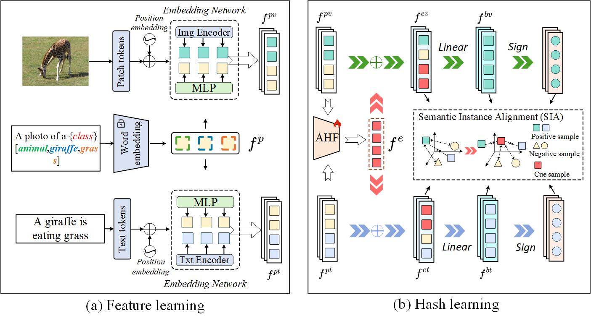

# Adaptive Hierarchical Cue Hashing for Cross-modal Retrieval (AHCH)

We propose AHCH, a supervised cross-modal hashing framework that combines cue learning, adaptive hierarchical fusion (AHF), and semantic instance alignment (SIA) for image-text retrieval.

## Framework



## Repository Files

We provide the following repository files:

| File           | Description                                |
| -------------- | ------------------------------------------ |
| `config.py`    | Experiment configuration file.             |
| `train.py`     | Training code and entry point.             |
| `load_data.py` | Dataset loading and splitting code.        |
| `log.txt`      | Training log supplied with the repository. |
| `main.jpg`     | Framework overview image.                  |

## Computing Environment

| Component                           | Configuration                                       |
| ----------------------------------- | --------------------------------------------------- |
| Operating system                    | Ubuntu 22.04                                        |
| Python                              | 3.12                                                |
| PyTorch                             | 2.5.1                                               |
| CUDA shown in the environment image | 12.4                                                |
| GPU                                 | 1 × NVIDIA GeForce RTX 4090, 24 GB VRAM             |
| CPU allocation                      | 22 vCPUs on an AMD EPYC 7T83 64-Core Processor host |
| System memory                       | 90 GB                                               |
| System disk                         | 30 GB                                               |
| Data disk                           | 50 GB                                               |

## Datasets and Preparation

We download the original datasets from their respective sources:

1. [MIRFLICKR25K](https://press.liacs.nl/mirflickr/)
2. [NUS-WIDE](https://github.com/NExTplusplus/NUS-WIDE)
3. [MS COCO](https://cocodataset.org/)

Original datasets remain subject to their providers' access conditions and licenses.

We adopt the following protocol for each source dataset:

| Subset                            | Sampling rule                                 |
| --------------------------------- | --------------------------------------------- |
| Query set                         | 5,000 randomly selected image-text pairs.     |
| Known retrieval database, D_k     | All remaining pairs from the source dataset.  |
| Training set                      | 10,000 pairs sampled from D_k.                |
| Unknown retrieval database, D_unk | Combined samples from the other two datasets. |

We ensure the training and query sets are disjoint; the training set is a subset of D_k. We resize images to 224 × 224 pixels and tokenize text using Byte Pair Encoding (BPE).

## Training Configuration

```python
dataset = "MIRFLICKR25K"
data_root = "./data/MIRFLICKR25K"
backbone = "CLIP ViT-B/32"
freeze_backbone = True
fusion_variant = "LF"
hash_length = 32
batch_size = 64
optimizer = "Adam"
learning_rate = 1e-4
weight_decay = 1e-5
epochs = 100
seed = 42
alpha = 0.5
beta = 0.5
lambda_quantization = 5.0
output_dir = "./outputs/MIRFLICKR25K/32bits/seed42"
```
